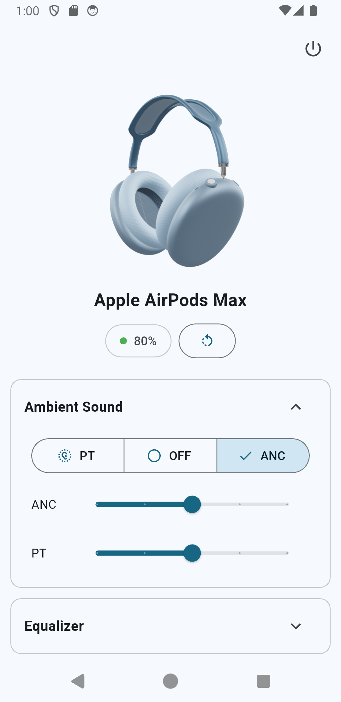
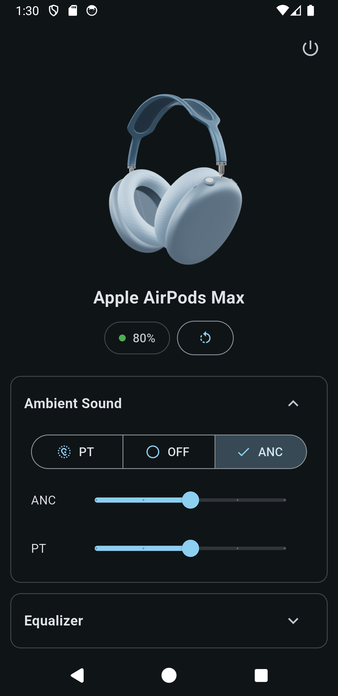
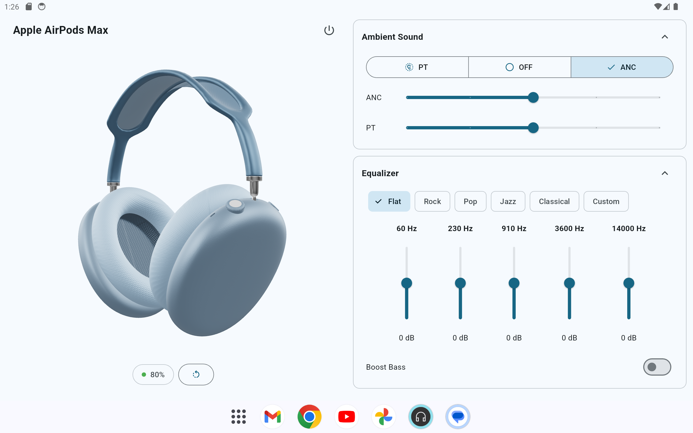
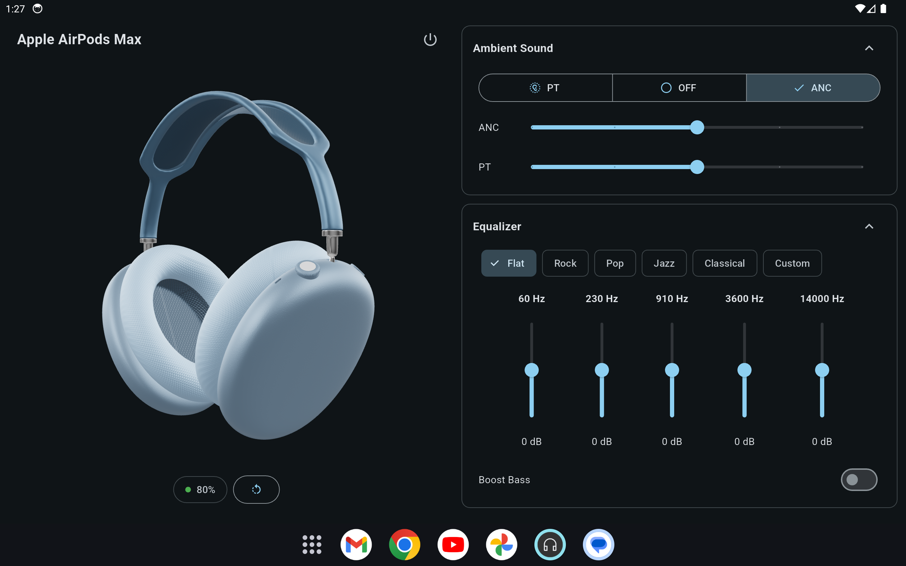

# 🎧 Headphones App 
This Android app is a UI study which aims to provide convenient controls for your headphones. The app includes an interactive 3D model of the headphones, giving users a visual representation of the device.

## 🖋️ Figma Sketch 

## 📱 Flutter Implementation 
|  |  |
|-------------------------------|-------------------------------|
| Portrait Light                | Portrait Dark                 |

|  |  |
|-------------------------------|-------------------------------|
| Landscape Light               | Landscape Dark                |
